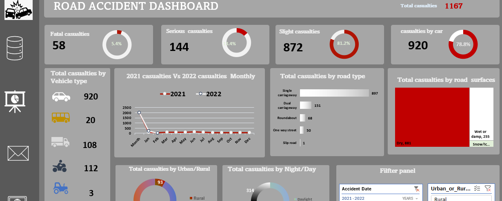

# 🚧 Road Accident Analysis Dashboard

## 📝 Description
This project explores patterns in road accidents using real-world data, with a focus on identifying monthly trends, accident severity, lighting and road conditions, and vehicle types. The goal is to visualize insights that can support traffic safety interventions, especially in urban areas.

## 📁 Dataset
- **Source**: UK road accident records
- **Data Range**: Accidents from 2021–2022
- **Key Features**: Date, time, number of casualties, vehicle type, road type, surface condition, light condition, police force region

## 🔧 Tools Used
- 📊 Microsoft Excel (Pivot Tables, Slicers, Charts)
- 🧮 KPI Calculation Sheets
- 📈 Dynamic Dashboard

## 🚀 Key Analysis & Insights
- Created interactive monthly and yearly trend charts
- Identified peak accident months and severity breakdown
- Analyzed the impact of road surface, lighting, and vehicle type
- Built a dashboard with filters for real-time exploration

## 📸 Sample Dashboard (optional screenshot)
```markdown


